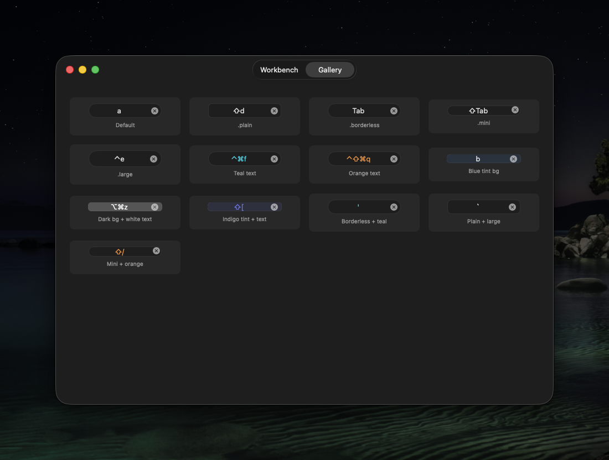

# ShortcutField

[](https://swift.org)
[](https://developer.apple.com/macos/)
[](LICENSE)

A keyboard shortcut recorder for macOS apps. Record, display, and match **in-app** keyboard shortcuts (single or sequential), including special keys like Tab that SwiftUI's focus system normally intercepts.



### Features

- Record single shortcuts (e.g. `⌘K`) or sequential shortcuts (e.g. `⌘K ⌘C`)
- Match shortcuts against key events, including special keys like Tab and Escape
- SwiftUI views and AppKit controls
- Codable, Equatable, Sendable models
- Three visual styles: rounded, plain, borderless
- Custom text and background colors

## Requirements

- macOS 13+
- Swift 6.2+

## Installation

Add ShortcutField to your project via Swift Package Manager:

```swift
dependencies: [
    .package(url: "https://github.com/nielsmadan/ShortcutField", from: "1.1.0")
]
```

## Usage

See the [Example app](Example/) for a workbench and gallery of all recorder styles.

### Recording Shortcuts (SwiftUI)

```swift
import ShortcutField

struct SettingsView: View {
    @State private var shortcut: Shortcut?

    var body: some View {
        ShortcutRecorderView($shortcut)
            .placeholder("Record Shortcut")
            .style(.rounded)
    }
}
```

### Recording Shortcuts (AppKit)

```swift
import ShortcutField

let field = ShortcutRecorderField()
field.onShortcutChange = { shortcut in
    print("Recorded: \(shortcut?.displayString ?? "none")")
}
```

### Matching Shortcuts

The `.onShortcut()` modifier handles both regular keys and special keys like Tab automatically:

```swift
MyView()
    .onShortcut(shortcut) {
        print("Shortcut fired!")
    }
```

For manual matching, use the `matches()` methods directly:

```swift
// Match against NSEvent (for keys like Tab that SwiftUI intercepts)
shortcut.matches(event)

// Match against SwiftUI KeyPress
shortcut.matches(press)
```

### Display Strings

```swift
let shortcut = Shortcut(keyCode: UInt16(kVK_Tab), modifiers: [.command, .shift])
print(shortcut.displayString) // "⇧⌘Tab"
```

### Styles

```swift
ShortcutRecorderView($shortcut).style(.rounded)    // Default
ShortcutRecorderView($shortcut).style(.plain)       // Minimal border
ShortcutRecorderView($shortcut).style(.borderless)  // No border
```

### Colors

```swift
ShortcutRecorderView($shortcut)
    .textColor(.systemTeal)
    .fieldBackgroundColor(NSColor.systemBlue.withAlphaComponent(0.1))
```

Setting a background color uses a layer-backed background because `NSSearchFieldCell` does not render `NSTextField.backgroundColor`.

## API

### `Shortcut`

The shortcut model. `Codable`, `Equatable`, `Sendable`.

| Property/Method | Description |
|---|---|
| `keyCode: UInt16` | Virtual key code |
| `modifiers: NSEvent.ModifierFlags` | Modifier flags |
| `displayString: String` | Human-readable, e.g. "⌘⇧K" |
| `matches(_ event: NSEvent) -> Bool` | Match against NSEvent |
| `matches(_ press: KeyPress) -> Bool` | Match against SwiftUI KeyPress (macOS 14+) |

### `ShortcutRecorderView`

SwiftUI recorder component.

| Modifier | Description |
|---|---|
| `.placeholder(_:)` | Text when empty (default: "Record Shortcut") |
| `.recordingPlaceholder(_:)` | Text during recording (default: "Press shortcut...") |
| `.style(_:)` | `.rounded`, `.plain`, or `.borderless` |
| `.textColor(_:)` | Text color (`NSColor`) |
| `.fieldBackgroundColor(_:)` | Background color (`NSColor`); uses a layer because `NSSearchFieldCell` ignores `backgroundColor` |

### `ShortcutRecorderField`

AppKit recorder (`NSSearchField` subclass). Also public for direct use.

### `.onShortcut(_:perform:)`

View modifier that fires an action when a shortcut is pressed. Requires macOS 14+.

Uses an NSEvent local monitor to match key events, including special keys like Tab that SwiftUI's focus system would normally intercept. The view does not need focus. Matching is automatically disabled while any recorder field is active.

### `ShortcutSequence`

A sequential shortcut composed of multiple steps. `Codable`, `Equatable`, `Sendable`.

```swift
let sequence = ShortcutSequence(steps: [
    Shortcut(keyCode: 40, modifiers: .command),  // ⌘K
    Shortcut(keyCode: 8, modifiers: .command),   // ⌘C
])
print(sequence.displayString) // "⌘K ⌘C"
```

| Property | Description |
|---|---|
| `steps: [Shortcut]` | Ordered steps (at least 1 required) |
| `displayString: String` | Human-readable, e.g. "⌘K ⌘C" |

### `ShortcutSequenceRecorderView`

SwiftUI recorder for sequential shortcuts.

```swift
@State private var sequence: ShortcutSequence?

ShortcutSequenceRecorderView($sequence)
    .placeholder("Record Sequence")
    .style(.rounded)
```

Press keys in order. The recording finalizes after a 1-second pause.

| Modifier | Description |
|---|---|
| `.placeholder(_:)` | Text when empty (default: "Record Sequence") |
| `.recordingPlaceholder(_:)` | Text during recording (default: "Press keys...") |
| `.style(_:)` | `.rounded`, `.plain`, or `.borderless` |
| `.textColor(_:)` | Text color (`NSColor`) |
| `.fieldBackgroundColor(_:)` | Background color (`NSColor`); uses a layer because `NSSearchFieldCell` ignores `backgroundColor` |

### `ShortcutSequenceRecorderField`

AppKit sequential recorder (`NSSearchField` subclass). Also public for direct use.

### `.onShortcutSequence(_:perform:)`

View modifier that fires an action when a shortcut sequence is pressed. Requires macOS 14+.

```swift
MyView()
    .onShortcutSequence(sequence) {
        print("Sequence matched!")
    }
```

Each modifier tracks independently, while an internal shared dispatcher delivers each key event to all active sequence matchers. That lets sequences with a common prefix (e.g. `⌘K ⌘C` and `⌘K ⌘T`) work correctly.

When an intermediate step uses Tab or Escape, the event is consumed to prevent focus changes. The final matching step is always consumed. Other intermediate keys propagate normally through the responder chain (see [Suppressing the system alert sound](#suppressing-the-system-alert-sound) below). Matching is automatically disabled while any recorder field is active.

## Notes

### Recorder behavior

Both `ShortcutRecorderField` and `ShortcutSequenceRecorderField` share these behaviors:

- **Click** the field to start recording
- **Escape** cancels recording without saving
- **Delete** clears the current shortcut or sequence (sequence recorder: only when no steps have been recorded yet)
- **Click outside** the field finalizes the recording
- Only one recorder can be active at a time. Focusing a new recorder ends the previous one.

The sequence recorder finalizes after a **1-second pause** between key presses. Each key press resets the timer.

### Suppressing the system alert sound

When using `.onShortcutSequence()`, intermediate key events propagate through the responder chain. If nothing else handles them, macOS plays the system alert sound. This does not affect `.onShortcut()`, which consumes its key event immediately.

To suppress the beep only during active sequence input (while still allowing it for random unhandled keys), check `ShortcutSequenceTracking.isActive` in a `noResponder(for:)` override on your window:

```swift
import ShortcutField

class MainWindow: NSWindow {
    override func noResponder(for eventSelector: Selector) {
        if eventSelector == #selector(keyDown(with:)),
           ShortcutSequenceTracking.isActive {
            return // suppress beep only during sequence tracking
        }
        super.noResponder(for: eventSelector)
    }
}
```

`ShortcutSequenceTracking.isActive` is `true` whenever at least one `.onShortcutSequence()` modifier has matched one or more intermediate steps and is waiting for the next key press. It resets automatically on completion, timeout, or mismatch.

### How does this differ from KeyboardShortcuts?

[KeyboardShortcuts](https://github.com/sindresorhus/KeyboardShortcuts) registers **global** (system-wide) hotkeys. ShortcutField records **in-app** shortcuts that you match yourself via `.onShortcut()` or `.onShortcutSequence()` view modifiers. ShortcutField also supports sequential shortcuts (chord sequences like `⌘K ⌘C`), which KeyboardShortcuts does not.

## Contributing

Issues and pull requests are welcome.

## Acknowledgments

ShortcutField's key mapping and display logic is adapted from [KeyboardShortcuts](https://github.com/sindresorhus/KeyboardShortcuts) by Sindre Sorhus (MIT license).

## License

MIT
