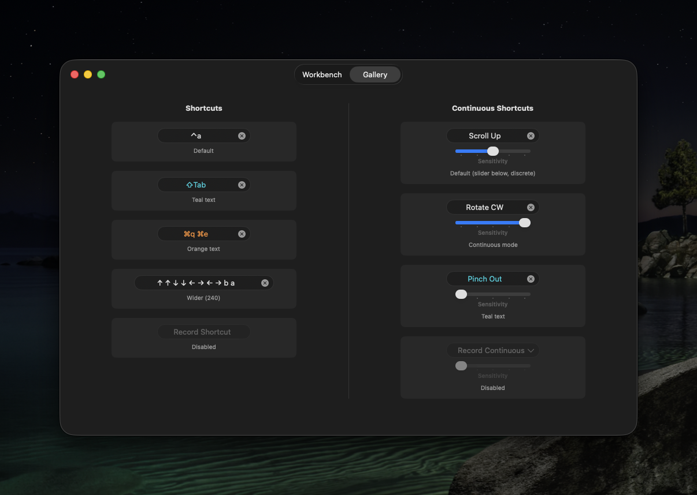

# ShortcutField

[](https://swift.org)
[](https://developer.apple.com/macos/)
[](LICENSE)

A unified in-app shortcut recorder for macOS apps.

`Shortcut` is the umbrella type, an enum with two cases:

- **`.discrete(DiscreteShortcut)`**: fire-once shortcuts. One step (e.g. `⌘K`, `Right Click`, `Pinch In`) or a multi-step sequence (e.g. `⌘K ⌘C`, `A → Right Click`). The matcher fires the bound action exactly once when the user completes the full sequence.
- **`.continuous(ContinuousShortcut)`**: sensitivity-bearing throttled continuous fire. A single scroll / pinch / rotate gesture with a user-tunable `sensitivity` controlling the throttle rate (e.g. scroll-to-zoom).

Special keys like Tab that SwiftUI's focus system normally intercepts work in both.



### Features

- Record any in-app input: key, mouse button, scroll direction, trackpad gesture (pinch / rotate / smart magnify)
- Multi-step shortcuts (e.g. `⌘K ⌘C`, `A → Right Click`, `⌘K → Pinch In`)
- Sensitivity-throttled continuous gestures via `ContinuousShortcut`
- One `.onShortcut()` modifier for both kinds, plus a public `ShortcutMatcher` for manual matching
- VS Code-style text syntax: `Shortcut("cmd+k cmd+c")`, `try Shortcut(ascii:)`, round-trippable `.ascii`
- Match against `NSEvent` and SwiftUI `KeyPress`, including special keys like Tab and Escape
- SwiftUI views and AppKit controls
- `Codable`, `Equatable`, `Hashable`, `Sendable` model

## Requirements

- macOS 13+
- Swift 6.2+

## Installation

Add ShortcutField to your project via Swift Package Manager:

```swift
dependencies: [
    .package(url: "https://github.com/nielsmadan/ShortcutField", from: "2.2.3")
]
```

## Usage

See the [Example app](Example/) for a workbench and gallery of all recorder styles.

### Recording fire-once shortcuts (SwiftUI)

```swift
import ShortcutField

struct SettingsView: View {
    @State private var shortcut: DiscreteShortcut?

    var body: some View {
        ShortcutRecorderView($shortcut)
            .placeholder("Record Shortcut")
    }
}
```

The recorder accepts whatever the user performs: a single keystroke, a (modified) mouse click, a scroll, a trackpad gesture, or a multi-step sequence. Recording finalizes after a 1-second idle pause OR on a bare left-click anywhere (no modifiers), the unambiguous "I'm done" gesture.

### Recording continuous (sensitivity-bearing) shortcuts

```swift
import ShortcutField

struct ZoomSettingsView: View {
    @State private var zoomShortcut: ContinuousShortcut?

    var body: some View {
        ContinuousShortcutRecorderView($zoomShortcut)
            .placeholder("Record Zoom")
    }
}
```

A chevron menu next to the field provides a click-only path for picking continuous kinds (scroll / pinch / rotate) without performing them.

### Recording shortcuts (AppKit)

```swift
import ShortcutField

let field = ShortcutRecorderField()
field.onShortcutChange = { shortcut in            // shortcut is DiscreteShortcut?
    print("Recorded: \(shortcut?.displayString ?? "none")")
}

let continuousField = ContinuousShortcutRecorderField()
continuousField.onShortcutChange = { shortcut in  // shortcut is ContinuousShortcut?
    print("Recorded: \(shortcut?.displayString ?? "none")")
}
```

### Matching shortcuts

`.onShortcut()` takes the umbrella `Shortcut?` and fires an action when it's performed: once on completion for `.discrete`, repeatedly (throttled) for `.continuous`:

```swift
// A recorder binds a DiscreteShortcut?; lift it into the umbrella to match it.
MyView()
    .onShortcut(recordedShortcut.map(Shortcut.discrete)) {
        print("Shortcut fired!")
    }

// A static shortcut can be a string literal (see Text syntax below).
MyView()
    .onShortcut("cmd+k cmd+c") {
        print("Chord fired!")
    }

// Continuous shortcuts fire repeatedly during the gesture, throttled by sensitivity.
MyView()
    .onShortcut(.continuous(zoomShortcut)) {
        zoomLevel += 0.05
    }
```

For 1-step discrete shortcuts the action fires once on the matching event. For multi-step shortcuts the action fires once when the full sequence completes within the per-step timeout (1 second). For continuous shortcuts it fires on each throttled gesture event.

For manual matching, drive a `ShortcutMatcher` yourself or use the `matches()` primitives directly:

```swift
// ShortcutMatcher: feed it NSEvents, inspect the ShortcutMatchResult.
let matcher = ShortcutMatcher(.discrete(shortcut))
switch matcher.handle(event) {
case .fired:                       runAction()
case .continuousFired(let delta):  runAction(scaledBy: delta)
case .advanced, .ignored:          break
}

// Or match a single Step / ContinuousShortcut against an NSEvent directly.
discreteShortcut.steps[0].matches(event)
discreteShortcut.steps[0].matches(press)   // SwiftUI KeyPress, .key kinds only
continuousShortcut.matches(event)
```

### Text syntax

`Shortcut` and `DiscreteShortcut` round-trip through a VS Code-style ascii string:

```swift
let chord: Shortcut = "cmd+k cmd+c"                  // ExpressibleByStringLiteral
let zoom = try Shortcut(ascii: "scroll-up @0.5")     // .continuous, sensitivity 0.5
let parsed = try DiscreteShortcut(ascii: "ctrl+right-click")

chord.ascii        // "cmd+k cmd+c"  (round-trips)
```

- **Modifiers**: `cmd`, `ctrl`, `opt`, `shift`, joined with `+`.
- **Keys**: `a`–`z`, `0`–`9`, `tab`, `return`, `escape`, `space`, `delete`, arrows, `home`/`end`/`pageup`/`pagedown`, `f1`–`f12`, punctuation names.
- **Mouse**: `left-click`, `right-click`, `middle-click`, `button4`, `button5`.
- **Scroll / gestures**: `scroll-up/down/left/right`, `pinch-in`, `pinch-out`, `rotate-clockwise`, `rotate-counterclockwise`, `smart-magnify`.
- **Multi-step**: space-separated steps, e.g. `cmd+k cmd+c`.
- **Sensitivity**: a ` @N` suffix (`0.0...1.0`) on a single bare gesture makes it `.continuous`, e.g. `pinch-out @0.5`.

A single bare gesture string resolves to `.continuous`; anything else (multi-step, key, mouse, `smart-magnify`) resolves to `.discrete`. `ExpressibleByStringLiteral` (used for *literals*) traps on a malformed string; the throwing `init(ascii:)` is for runtime input and throws `ShortcutParsingError`.

### Display strings

```swift
let key = DiscreteShortcut(keyCode: UInt16(kVK_Tab), modifiers: [.command, .shift])
print(key.displayString) // "⇧⌘Tab"

let click = DiscreteShortcut(kind: .mouseButton(number: 1), modifiers: .control)
print(click.displayString) // "⌃Right Click"

let sequence = DiscreteShortcut(steps: [
    .init(keyCode: 40, modifiers: .command),  // ⌘K
    .init(keyCode: 8, modifiers: .command),   // ⌘C
])
print(sequence.displayString) // "⌘K ⌘C"

let zoom = ContinuousShortcut(kind: .pinchIn, modifiers: .command, sensitivity: 0.5)
print(zoom.displayString) // "⌘Pinch In"
```

The umbrella `Shortcut` has a `displayString` that forwards to the inner value's.

### Customization

```swift
ShortcutRecorderView($shortcut)
    .textColor(.teal)
    .minimumWidth(180)
```

The same modifiers apply to `ContinuousShortcutRecorderView`.

### Sensitivity (ContinuousShortcut only)

The sensitivity controls how often a `.continuous` `.onShortcut()` fires during a single physical gesture: `0.0` fires once per gesture, `1.0` fires on every matching event, intermediate values map to a per-fire cooldown.

```swift
ContinuousShortcutRecorderView($zoomShortcut)
    .sensitivityMode(.discrete)        // .discrete (5 ticks) or .continuous
    .sensitivityPosition(.below)        // .below, .left, or .right
```

Discrete mode snaps to five tick marks (0, 0.25, 0.5, 0.75, 1.0). Continuous is a free 0.0-1.0 slider.

> **Why no swipe gestures?** macOS only delivers `NSEvent.swipe` events to apps when the user has enabled "Swipe between pages: Swipe with three fingers" in System Settings → Trackpad → More Gestures, and 4-finger swipes have no equivalent setting (they're reserved by macOS for Mission Control / App Exposé / switch-between-full-screen-apps). Reliable cross-app multi-finger gesture detection on macOS requires the private `MultitouchSupport` framework (used by apps like BetterTouchTool), which would prevent App Store distribution and risk notarization. ShortcutField stays within public APIs, so swipes are out of scope.

## API

### `Shortcut`

The umbrella shortcut type, an enum over the two kinds. `Codable`, `Equatable`, `Hashable`, `Sendable`, `ExpressibleByStringLiteral`.

| Case / Member | Description |
|---|---|
| `.discrete(DiscreteShortcut)` | A fire-once shortcut |
| `.continuous(ContinuousShortcut)` | A sensitivity-bearing continuous shortcut |
| `kind: Shortcut.Kind` | `.discrete` or `.continuous` |
| `displayString: String` | Forwards to the inner value's display string |
| `init(ascii:) throws` | Parse a text shortcut; resolves discrete vs continuous (see Text syntax) |
| `ascii: String` | Round-trippable text representation |

### `DiscreteShortcut`

A fire-once shortcut: one or more ordered steps. `Codable`, `Equatable`, `Hashable`, `Sendable`.

| Property/Method | Description |
|---|---|
| `steps: [Step]` | One or more ordered steps (non-empty) |
| `displayString: String` | Steps joined by space, e.g. `⌘K ⌘C` |
| `init(steps:)` | Build from an explicit step list |
| `init(kind:modifiers:)` | Convenience for a 1-step shortcut |
| `init(keyCode:modifiers:)` | Convenience for a 1-step keyboard shortcut |
| `init(ascii:) throws` | Parse a text shortcut (a ` @N` sensitivity suffix throws) |
| `ascii: String` | Round-trippable text representation |

#### `DiscreteShortcut.Step`

A single recordable input within a shortcut.

| Property/Method | Description |
|---|---|
| `kind: DiscreteShortcut.Kind` | `.key(keyCode:)`, `.mouseButton(number:)`, `.scroll(direction:)`, `.pinchIn`, `.pinchOut`, `.rotateClockwise`, `.rotateCounterClockwise`, `.smartMagnify` |
| `modifiers: NSEvent.ModifierFlags` | Modifier flags (Command, Shift, Option, Control) |
| `displayString: String` | Human-readable, e.g. `⌘K`, `⌃Right Click`, `⇧Scroll Up`, `⌘Pinch In` |
| `init(kind:modifiers:)` | Build any kind |
| `init(keyCode:modifiers:)` | Convenience for keyboard steps |
| `matches(_ event: NSEvent) -> Bool` | Match against an NSEvent (any kind) |
| `matches(_ press: KeyPress) -> Bool` | Match against a SwiftUI KeyPress (key kinds only; macOS 14+) |

### `ContinuousShortcut`

Sensitivity-bearing single-step shortcut for throttled continuous fire. `Codable`, `Equatable`, `Hashable`, `Sendable`.

| Property/Method | Description |
|---|---|
| `kind: ContinuousShortcut.Kind` | Continuous kind only: `.scroll`, `.pinchIn/Out`, `.rotateClockwise/CounterClockwise`. Discrete kinds are unrepresentable at the type level. |
| `modifiers: NSEvent.ModifierFlags` | Modifier flags (Command, Shift, Option, Control) |
| `sensitivity: Double` | 0.0 (fire once per gesture) to 1.0 (every matching event), clamped in init |
| `displayString: String` | Human-readable, same format as a single `DiscreteShortcut.Step` |
| `init(kind:modifiers:sensitivity:)` | Build with sensitivity (default 0.0) |
| `matches(_ event: NSEvent) -> Bool` | Match against an NSEvent |

#### `ContinuousShortcut.Kind`

The continuous-only subset of `DiscreteShortcut.Kind`. Lift to / project from the discrete kind via `asDiscreteKind` and `init(_ discreteKind:)` (the latter returns nil for discrete-only kinds).

```swift
public enum Kind: Sendable, Equatable, Hashable {
    case scroll(direction: DiscreteShortcut.ScrollDirection)
    case pinchIn, pinchOut
    case rotateClockwise, rotateCounterClockwise
}
```

### `ShortcutMatcher`

`@MainActor` matcher for driving event matching yourself. Construct one with any `Shortcut` and feed it `NSEvent`s.

| Member | Description |
|---|---|
| `init(_ shortcut: Shortcut)` | Build a matcher for a discrete or continuous shortcut |
| `handle(_ event: NSEvent) -> ShortcutMatchResult` | Feed one event; see `ShortcutMatchResult` below |
| `reset()` | Discard in-progress sequence / throttle state |
| `trackingStateDidChange: ((Bool) -> Void)?` | Notified when a multi-step match starts/stops tracking |

`ShortcutMatchResult` is `.ignored`, `.advanced(consumeEvent:)` (matched but did not complete a fire; consume per the flag), `.fired` (a discrete shortcut completed), or `.continuousFired(magnitude:)` (a throttled continuous fire, with the event's signed delta).

### `ShortcutEventDispatcher`

`@MainActor` app-wide singleton wrapping a single `NSEvent` local monitor with handler fan-out. `.onShortcut()` is built on it; use it directly for custom dispatch.

| Member | Description |
|---|---|
| `ShortcutEventDispatcher.shared` | The shared instance |
| `register(id: UUID, handler:)` | Register a handler (`(NSEvent) -> ShortcutMatchResult`); the monitor installs lazily on the first registration |
| `unregister(id: UUID)` | Remove a handler; the monitor is torn down when the last one is removed |

Handlers are consulted **newest-first**; the event is consumed if any returns `.fired`, `.continuousFired`, or `.advanced(consumeEvent: true)`. Every handler still sees every event, so prefix-sharing matchers all advance in parallel.

### `ShortcutParsingError`

Thrown by `init(ascii:)`: `.empty`, `.unknownModifier(String)`, `.unknownKey(String)`, `.unknownGesture(String)`, `.malformedSensitivity(String)`, `.sensitivityOnDiscrete`, `.emptyStep`.

### `ShortcutRecorderView`

SwiftUI recorder for fire-once shortcuts. Binds a `DiscreteShortcut?`.

| Modifier | Description |
|---|---|
| `.placeholder(_:)` | Text when empty (default: "Record Shortcut") |
| `.recordingPlaceholder(_:)` | Text during recording (default: "Record shortcut…") |
| `.textColor(_:)` | Text color (SwiftUI `Color`) |
| `.minimumWidth(_:)` | Minimum intrinsic width in points (default 160). SwiftUI's `.frame(width:)` still wins. |

### `ContinuousShortcutRecorderView`

SwiftUI recorder for sensitivity-bearing continuous shortcuts. Binds a `ContinuousShortcut?`.

| Modifier | Description |
|---|---|
| `.placeholder(_:)` | Text when empty (default: "Record Continuous") |
| `.recordingPlaceholder(_:)` | Text during recording (default: "Scroll / pinch / rotate…") |
| `.textColor(_:)` | Text color (SwiftUI `Color`) |
| `.minimumWidth(_:)` | Minimum intrinsic width in points (default 160). SwiftUI's `.frame(width:)` still wins. |
| `.sensitivityMode(_:)` | `.discrete` (default) or `.continuous` |
| `.sensitivityPosition(_:)` | `.below` (default), `.left`, or `.right`; placement of the sensitivity slider |

### AppKit recorder fields

`ShortcutRecorderField` (records `DiscreteShortcut?`) and `ContinuousShortcutRecorderField` (records `ContinuousShortcut?`) are the underlying `NSSearchField` subclasses. Public for direct use.

### `.onShortcut(_:perform:)`

View modifier that fires an action when a `Shortcut` is performed. Takes the umbrella `Shortcut?`.

For `.discrete` shortcuts the action fires once on completion: immediately for 1-step, after the full sequence for multi-step (intermediate events propagate normally; only focus-intercepted keys like Tab/Escape are consumed mid-sequence). For `.continuous` shortcuts it fires on each throttled gesture event. Multiple shortcuts that share a common prefix (e.g. `A B` and `A T`) work correctly: each tracks independently and the shared dispatcher delivers every event to all active matchers. Matching is automatically disabled while any recorder field is active.

### `ShortcutTracking`

`@MainActor` namespace exposing one read-only flag.

| Property | Description |
|---|---|
| `ShortcutTracking.isActive: Bool` | `true` when at least one `ShortcutMatcher` is partway through matching a multi-step shortcut, whether built by `.onShortcut()` or constructed directly. Used to suppress the macOS system alert beep on intermediate keys (see [Suppressing the system alert sound](#suppressing-the-system-alert-sound)). |

### `ShortcutRecording`

`@MainActor` namespace exposing one read-only flag.

| Property | Description |
|---|---|
| `ShortcutRecording.isActive: Bool` | `true` when any recorder field (fire-once or continuous) is currently capturing input. Useful for hosts that want to suppress their own keyboard handling, hotkey libraries, or menu key equivalents while a shortcut is being recorded. |

## Notes

### Recorder behavior

Both `ShortcutRecorderField` and `ContinuousShortcutRecorderField` share these behaviors:

- **Click** the field to start recording
- **Escape** cancels recording without saving
- **Delete** clears the current shortcut (multi-step recorder: only when no steps have been recorded yet)
- Only one recorder can be active at a time. Focusing a new recorder ends the previous one.

`ShortcutRecorderField` finalizes after a 1-second pause between captured steps OR on a bare left-click anywhere (no modifiers). Each captured step resets the idle timer. **Bare left-click can't be a step**: it's reserved for UI interaction (focusing controls, dismissing the recorder) and serves as the "finalize" gesture. Modified left clicks (e.g. `⌃Left Click`) are capturable. All other inputs, including right click and other mouse buttons, can be captured anywhere with no modifiers required.

`ContinuousShortcutRecorderField` finalizes on the first matching gesture event (after threshold accumulation for pinch / rotate). It only accepts continuous kinds; keys, mouse buttons, and smart-magnify are ignored during recording. A chevron menu provides click-only entry for picking gesture kinds without performing them.

### Suppressing the system alert sound

When using `.onShortcut()` with multi-step shortcuts, intermediate key events propagate through the responder chain. If nothing else handles them, macOS plays the system alert sound.

To suppress the beep only during active sequence input (while still allowing it for random unhandled keys), apply the `suppressShortcutBeep()` modifier to any view in your scene:

```swift
import ShortcutField

WindowGroup {
    ContentView()
        .suppressShortcutBeep()
}
```

This is the recommended path for SwiftUI hosts, which don't own the `WindowGroup` window's class. It installs a one-time `noResponder(for:)` override on the hosting window's class, gated on `ShortcutTracking.isActive`.

If you're an AppKit host that owns its `NSWindow` subclass, override `noResponder(for:)` directly instead:

```swift
import ShortcutField

class MainWindow: NSWindow {
    override func noResponder(for eventSelector: Selector) {
        if eventSelector == #selector(keyDown(with:)),
           ShortcutTracking.isActive {
            return // suppress beep only during in-progress multi-step matches
        }
        super.noResponder(for: eventSelector)
    }
}
```

`ShortcutTracking.isActive` is `true` whenever at least one `ShortcutMatcher` has matched one or more intermediate steps and is waiting for the next event, whether the matcher was built by `.onShortcut()` or constructed directly by a host. It resets automatically on completion, timeout, or mismatch.

### System-reserved hotkeys

Shortcuts that collide with a macOS system hotkey, such as `Cmd+Space` (Spotlight), the Mission Control / Spaces keys, or screenshot shortcuts, cannot be recorded or matched. macOS consumes those combos at the system level before they ever reach the app, and ShortcutField only sees events delivered to the app (it uses local `NSEvent` monitors, not a system event tap).

This is different from Tab: Tab *is* delivered to the app, macOS just routes it through the in-app focus system first, so ShortcutField can intercept it. A system-reserved combo never arrives at all.

Symptoms:

- In the recorder, pressing such a combo does nothing: the recorder can't see it, so it captures no step.
- A shortcut recorded *before* the user enabled the conflicting OS shortcut will silently stop firing once the OS claims the combo.

There's no in-app workaround; intercepting system hotkeys requires a system-wide event tap with Accessibility permission, which is out of scope for an in-app shortcut library. If you need global/system-wide hotkeys, see [KeyboardShortcuts](https://github.com/sindresorhus/KeyboardShortcuts).

## Contributing

Issues and pull requests are welcome.

## Acknowledgments

ShortcutField's key mapping and display logic (see [`DiscreteShortcut+KeyMapping.swift`](Sources/ShortcutField/DiscreteShortcut+KeyMapping.swift)) is adapted from [KeyboardShortcuts](https://github.com/sindresorhus/KeyboardShortcuts) by Sindre Sorhus (MIT license).

## License

MIT
